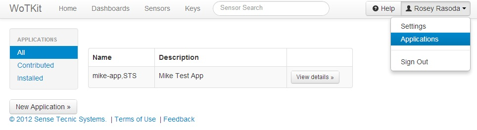

.. _user_clients:

Managing WoTKit API Clients
===========================

Clients of the WoTKit API include third partly applications, sensor gateways, and scripts.

You can manage the access these clients have to your sensor data and remove the need for external clients to share your personal WoTKit name and password in one of two ways:

* :ref:`key-authentication`.
* :ref:`applications-and-oath`.

Once granted access, WoTKit clients can create, modify, or delete sensors and sensor data on your behalf.

.. _key-authentication:

Keys and Basic Authentication
-----------------------------

A user can generate a key id and key password for WoTKit API clients as follows:

* Select the "Keys" tab and click on the ''New Key'' button. 
* Fill out the form with information to identify how the key is used, and click ''Add''.  Once created, a 'key id' and 'key password' will be generated. 
* To view the key, click ''View Key''.

The generated 'key id' and 'key password' can be used as the name and password in the basic authentication headers used when accessing the WoTKit API.

.. image:: images/Keys.jpg
	:width: 500 px

.. _applications-and-oath:

Applications and OAuth2 Authorization
-------------------------------------

Applications are clients of the WoTKit that can access the WoTKit API on behalf of more than one user.
Application credentials provided during the registration process are unique to that application.  All applications appear in the WoTKit application list.  They can connect to the WoTKit on behalf of a WoTKit user using the OAuth2 authorization process.  
    
.. only:: smartstreets

    Applications and Oauth2 Authorization are not supported by smartstreets.

To register a new WoTKit application:

* Select the user menu (located at the top right).
* Click on your user name in the top right, and select "Applications" from the drop down list. Click on the ''New Application'' button.
* Fill out the form, and click ''Add''.  Once registered with an 'application client id', an 'application secret' will be automatically generated.
* To view application information, click ''View details''.

Using the supplied 'application client id' and 'application secret' applications obtain an *access token* to access WoTKit sensors on behalf of a user.

For an application to obtain an access token it requests authorization.

    1. The application first requests an authorization code by providing its 'application client id' to the WoTKit using its OAuth2 endpoint:

    	:wotkit-api:`oauth/authorize?client_id={application client id}&response_type=code&redirect_uri={redirect uri}`

    2. If no user is currently logged in to the WoTKit, a login page will be presented. A WoTKit user must provide their user name and password to continue. 

    3. A page will then ask the user to authorize the application to connect to the WoTKit on their behalf. Once authorized, the authorization code is provided to the application by redirection.

    4. The application receives the authorization code and exchanges it along with the application credentials for an access token to use the WoTKit API.

Please see the :ref:`api-documentation` and in particular :ref:`api_authentication` for more details.

