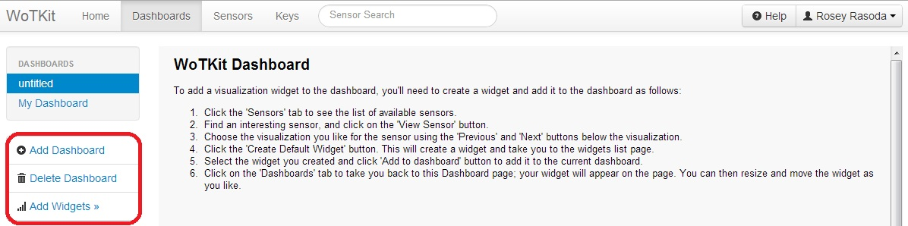
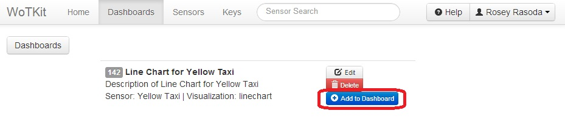
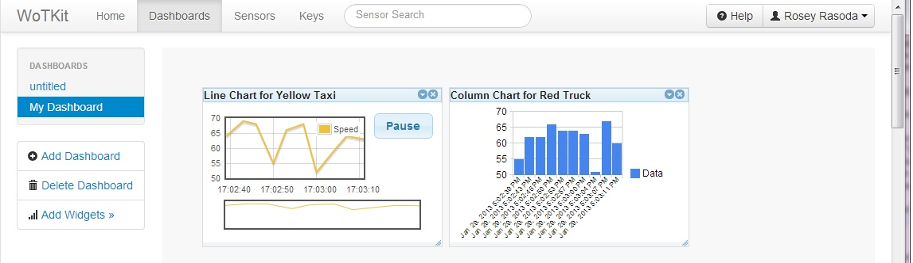

.. _user_dashboards:

Dashboards
==========

Dashboards allow you to view multiple widgets displaying sensor data. 

To view your dashboards, select the *Dashboards* tab. 

When viewing a new dashboard, you will see the following view with a help message. 
By default, there will be an empty dashboard labeled 'untitled'. 

From here, you can:
* Select an existing dashboards by clicking another dashboard on the left of the page. 
* Add a new dashboard by clicking ''Add Dashboard''.
* Rename a dashboard by clicking on the Edit link. 
* Delete a new dashboard by clicking ''Delete Dashboard''.

.. note::
    
    You must have at least one dashboard at all times. If you only have one dashboard, it cannot be deleted.

Adding Widgets to a Dashboard
-----------------------------

To add a sensor widget to a dashboard:
* Select the "Dashboard" tab.
* Click on the dashboard that you wish to add a widget to.
* Click on ''Add Widgets''.
* Choose which widget to add, and click on its ''Add to Dashboard'' button.

.. note::
   This will add the widget to the last dashboard you viewed.  If there are no widgets, you must create a widget by viewing a sensor.  See ...

After adding a widget to a dashboard, the widgets will be displayed on the dashboard as shown. You can drag and resize them to any position on the dashboard.

