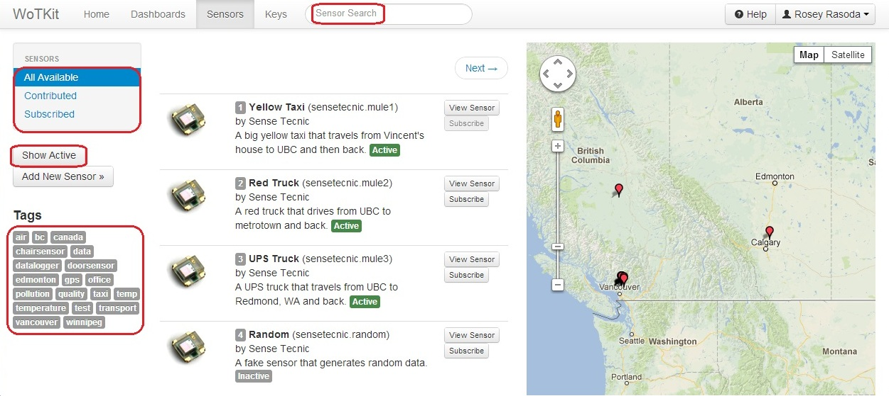
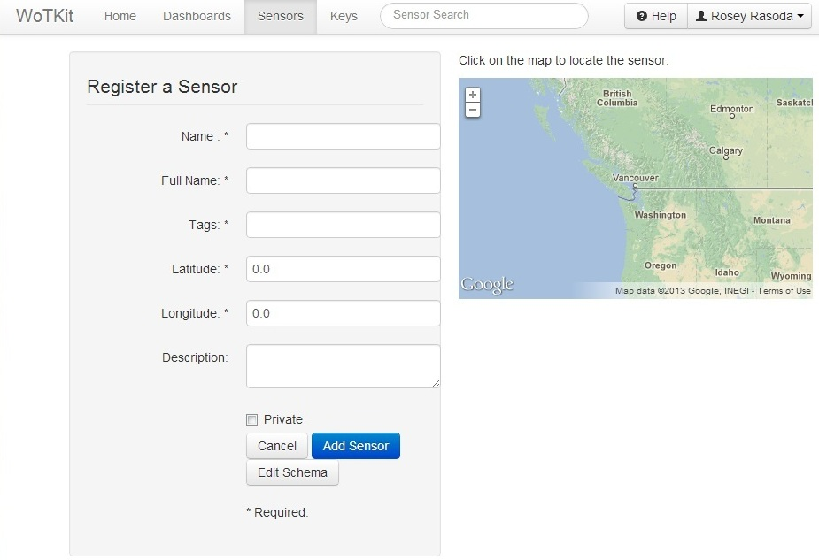
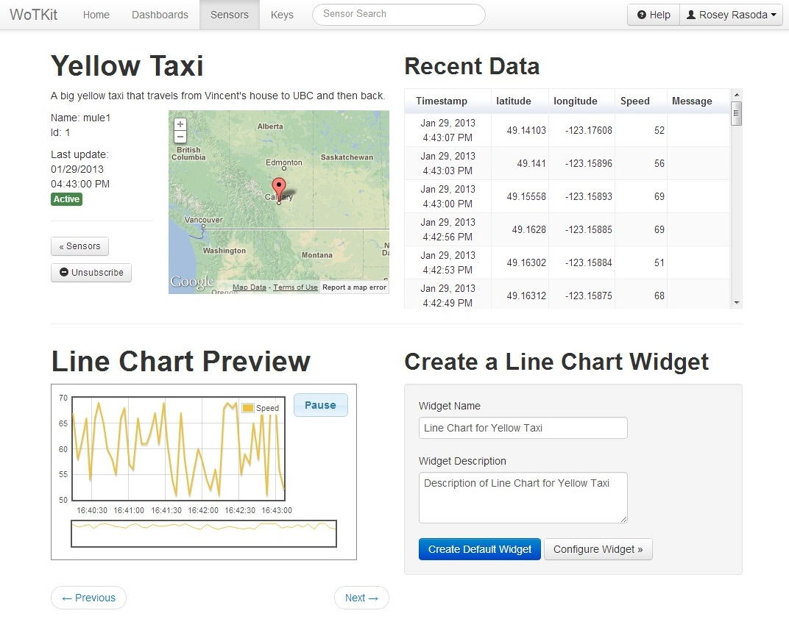
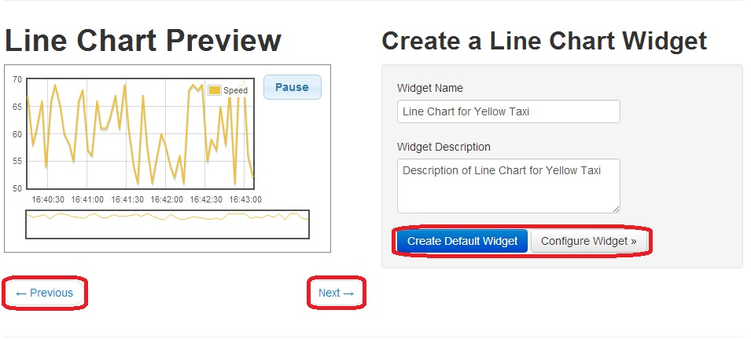
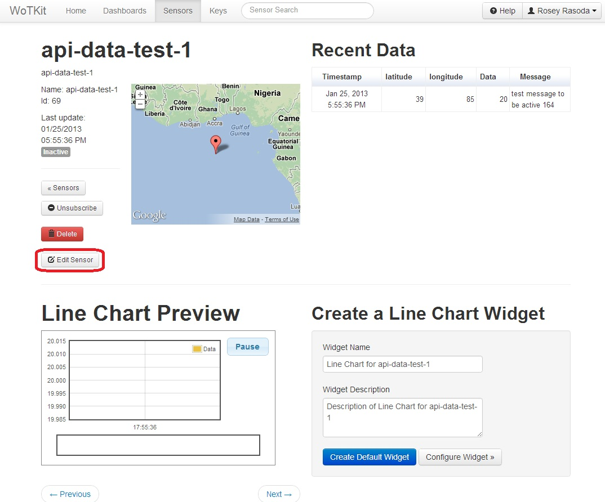
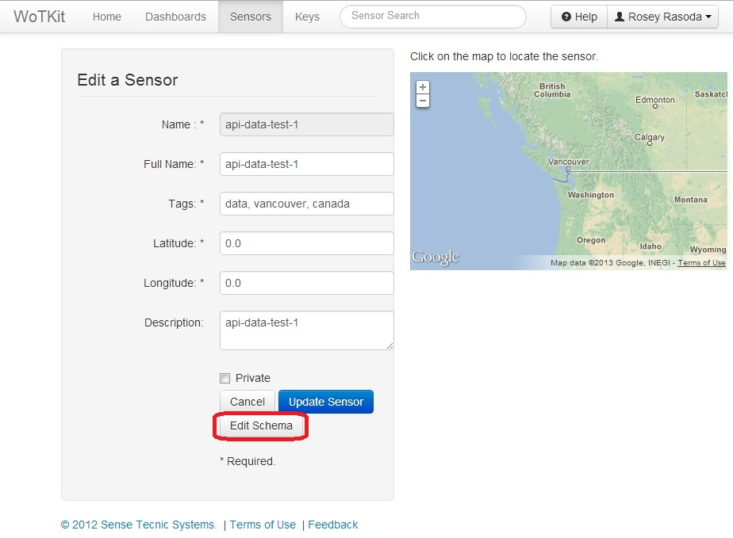
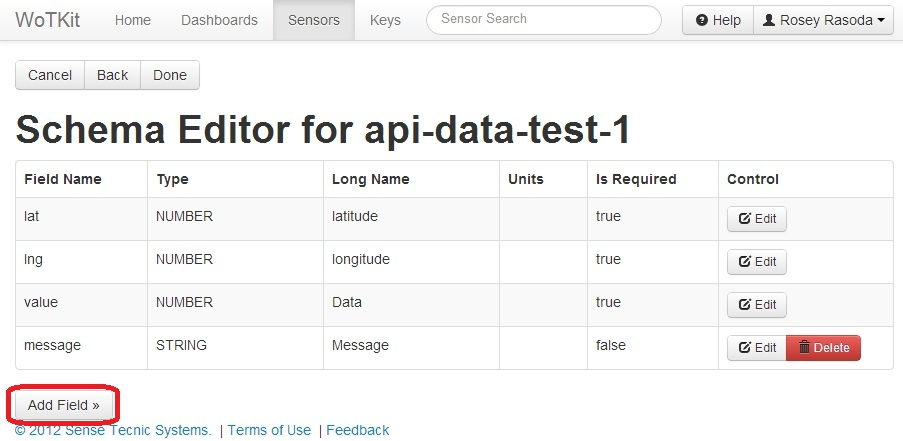

.. _user_sensors:

.. index:: Sensors

Sensors
=========

To view the sensor gallery, click on the *Sensors* tab. 

All available sensors are listed here, with the ability to page through the list and perform queries on the available sensors, filter based on tags, organizations and visibility.

From there, there are three additional list views: 

* **All Available**: display all of the sensors you can view on the WoTKit including public sensors, sensors that are in organizations you are a member of, and any private sensors you've contributed.
* **Subscribed**: showing all sensors to which the user has subscribed.
* **Contributed**: showing all sensors the user has added to the WoTKit.

These list views can be further narrowed as follows:
* Using the search bar at the top of the screen. This searches by text contained in the sensor name and description.

* Selecting a tag from the tag list displayed on the left of the screen.

* Selecting the *Show Active* button displayed on the left of the screen.  Active sensors are those which have received data in the last 15 minutes. 

In addition to this list view, a map view is available that is automatically centered on the sensors in your list view.

.. _new_sensor:

.. index:: Sensor Creation
	
Registering a New Sensor
---------------------------

To add a new sensor, click *Add New Sensor* button. 

From here, you can provide basic information about your sensor, including:

* **Name**
	* Unique URL-friendly name for the sensor.
* **Full Name**
    * Name for the sensor shown in various lists and views.
* **Tags**
	* Tags for the sensor separated by commas.
* **Description**
	* A description for the sensor.
* **Latitude** & **Longitude**
	* The static location of the sensor entered manually or by using the provided map. 
* **Visibility**
	* A private sensor cannot be viewed by other users.
	* The default is for a sensor to be public.  

All fields except Description and Visibility are required. 

Fill the necessary information and click the *Add Sensor* button.

.. _monitor:

.. index:: Monitor View
	
Monitoring Sensors
--------------------

The sensor monitor view privides details about the sensor, recent data sent to a sensor, and a way to visualize sensor data.

To monitor a sensor, select the *Sensors* tab, find the sensor you want to monitor, and click on the sensor.

This page allows you to:

* *Subscribe* or *Unsubscribe* from this sensor data feed by clicking the corresponding button.
* View sensor data using a visualization for your sensor data.
* Customize and create a new dashboard widget. (For details, see see :ref:`Creating a Widget <create_widget>` and :ref:`Adding Widgets to a Dashboard <add_widget>`.)

If you contributed the sensor to the WoTKit, you can also:

* Delete the sensor by clicking the *Delete* button.
* Edit sensor information by clicking the *Edit Sensor* button. (For details, see :ref:`Editing Sensors <edit_sensors>`.)

.. _create_widget:

.. index:: Widget Creation
	
Creating a Widget Visualization
--------------------------------

To create a widget for a sensor:

* On the :ref:`Monitor View <monitor>`, choose a widget.
	* Using the *Previous* and *Next* buttons to find the correct visualization. 
* Create the widget using the *Create Default Widget* or *Configure Widget* button. 
	* Provide as much information for the widget as you would like. 

Once the widget is created, you will be taken to the :ref:`Widgets View <add_widget>`.

.. _edit_sensor:

.. index:: Sensor Editing	
	
Editing Sensor Information
----------------------------

.. note:: You can only edit sensors you have contributed to the WoTKit. 

On the :ref:`Monitor View <monitor>`, select the *Edit Sensor* button.

---

By clicking the *Edit Sensor* button, you can change the information you initially registered for the sensor.
(The existing information for the sensor will be present to help you edit what is there.)
Additionally, you may edit the fields for sensor data using the *Edit Schema* button. 

---

By clicking the *Edit Schema* button, you may add, modify, or delete schema data fields properties for the sensor's data.  To add a new sensor field, for example, click the *Add Field* button. 

